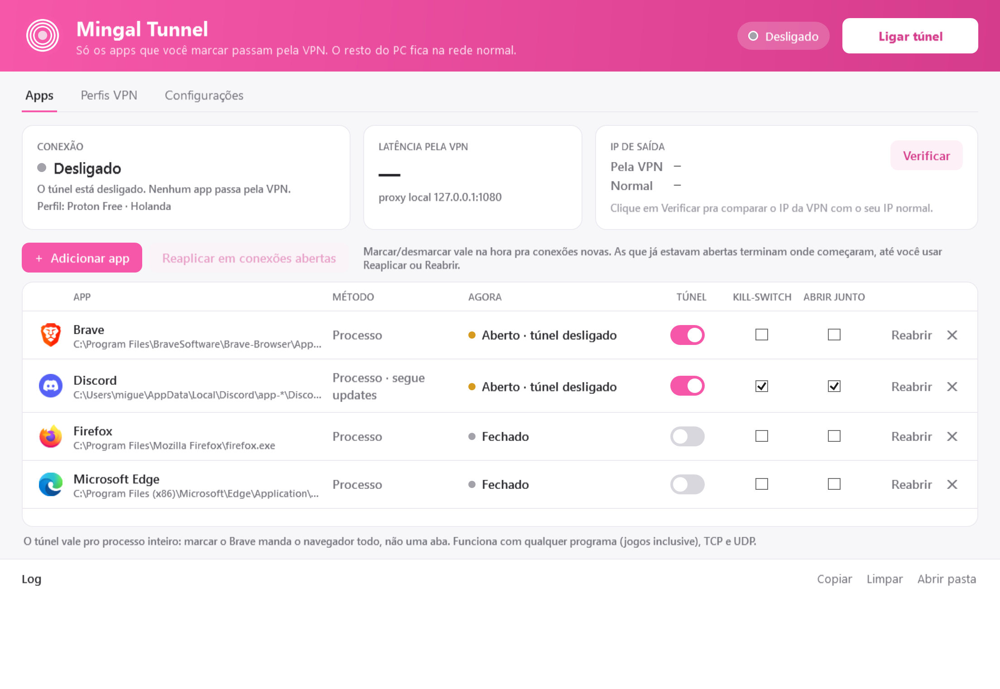
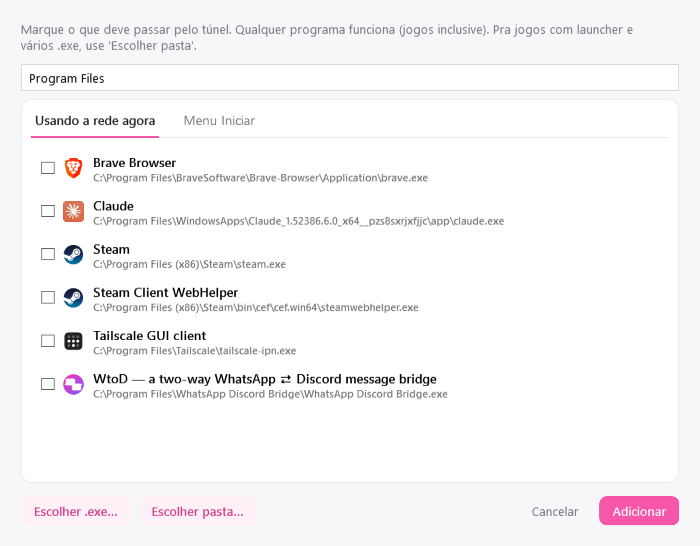
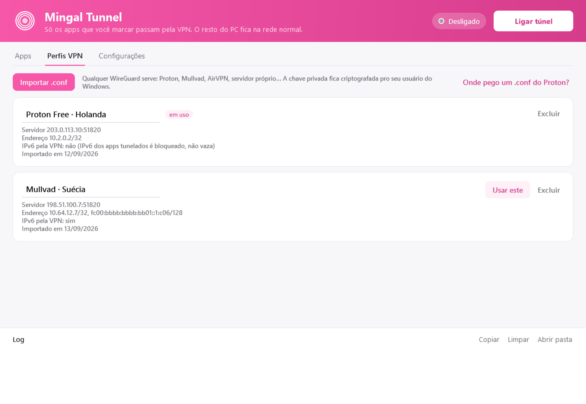
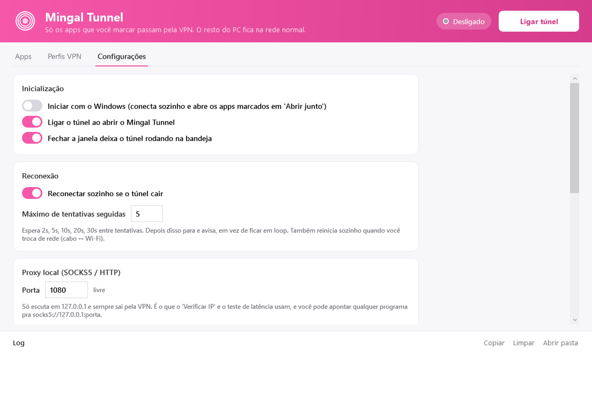

<p align="center">
  
</p>

<h1 align="center">Mingal Tunnel</h1>

<p align="center">
  <b>Split tunneling por app pra Windows.</b><br>
  Você escolhe quais programas passam pela VPN. O resto do PC continua na conexão normal.
</p>

<p align="center">
  <a href="https://github.com/himingal/mingal-tunnel/releases/latest"></a>
  
  
  
</p>

<p align="center">
  
</p>

Funciona com qualquer VPN WireGuard, inclusive as que não têm split tunneling nativo (Proton VPN free, Mullvad, servidor próprio). Nasceu pra fazer o **Go Live do Discord** funcionar sem jogar o PC inteiro na VPN, e hoje vale pra qualquer app: navegador, jogo, launcher.

É o sucessor do [discord-tunneling](https://github.com/himingal/discord-tunneling), agora com janela, lista de apps, perfis e sem mexer em atalho nenhum.

## O que ele faz

| | |
|---|---|
| 🎯 **Por processo, TCP e UDP** | Voz, vídeo, Go Live e jogos passam pelo túnel, não só o tráfego web. |
| ⚡ **Aplica na hora** | Marcou ou desmarcou um app, vale pras conexões novas em segundos, sem reiniciar o túnel. |
| 🔄 **Sobrevive a updates** | Discord/Slack (`app-*`) e apps da Microsoft Store continuam tunelados depois de se atualizarem. |
| 🛡️ **Kill-switch por app** | Opcional. Se o túnel cair, o app fica sem internet em vez de vazar pela rede normal. |
| 🌐 **Sem vazamento de IPv6** | Se a sua rede tem IPv6 e a VPN não, o IPv6 dos apps tunelados é bloqueado. |
| 🔁 **Reconecta sozinho** | Detecta queda, troca de rede (cabo ↔ Wi-Fi) e VPN sem resposta, com limite de tentativas. |
| 🔍 **Verificar IP** | Compara o IP de saída pela VPN com o seu IP normal. |
| 🚀 **Inicia com o Windows** | Sem UAC no logon. Abre os apps escolhidos depois que o túnel conecta. |

<table>
  <tr>
    <td width="50%"><br><sub>Adicionar qualquer programa: os que estão usando a rede, o Menu Iniciar, um .exe ou uma pasta inteira (jogos com launcher).</sub></td>
    <td width="50%"><br><sub>Vários perfis WireGuard. A chave privada fica criptografada pro seu usuário do Windows.</sub></td>
  </tr>
  <tr>
    <td colspan="2"><br><sub>Inicialização, reconexão, porta do proxy local e motor.</sub></td>
  </tr>
</table>

<sub>Prints com perfis de exemplo (endereços de documentação, não são servidores reais).</sub>

## Instalar

1. Baixe o `MingalTunnel-Setup-x.y.z.exe` em [Releases](https://github.com/himingal/mingal-tunnel/releases).
2. Instale e abra. O Windows pede Administrador, porque é assim que o app cria o adaptador de rede virtual.
3. Na aba **Perfis VPN**, clique em **Importar .conf**.
   No Proton: account.protonvpn.com → Downloads → WireGuard configuration → escolha um servidor.
4. Clique em **Ligar túnel**. O Discord já vem marcado. Marque os outros apps que quiser.

Se o **Discord Tunneling** antigo estiver instalado, o Mingal Tunnel oferece importar o perfil dele e desligar o antigo. Dois túneis ao mesmo tempo brigariam pela rota padrão.

## Como funciona

```
.conf WireGuard ─► perfil (chave criptografada com DPAPI)
apps marcados   ─► tunneled-apps.json (rule-set que o sing-box recarrega sozinho)
                           │
             config via stdin (a chave nunca vai pro disco)
                           ▼
                sing-box (processo filho do app)
                 ├─ adaptador TUN "MingalTunnel"
                 ├─ processo marcado? ─► WireGuard ─► internet pela VPN
                 └─ todo o resto      ─► placa de rede ─► internet normal
```

O motor é o [sing-box](https://github.com/SagerNet/sing-box) em modo TUN. Ele descobre qual processo abriu cada conexão e decide a saída por isso. O app só gera a configuração, supervisiona o processo e mostra o que está acontecendo. Se o Mingal Tunnel fechar ou travar, o Windows derruba o sing-box junto, então nunca fica um túnel órfão.

## Limitações conhecidas

- **O túnel vale pro processo inteiro.** Marcar o Brave manda o navegador todo, não uma aba.
- **Apps feitos com WebView2** (novo Teams, WhatsApp Desktop, novo Outlook) usam o `msedgewebview2.exe`, que é compartilhado entre eles. Tunelar esse executável tunela todos juntos.
- **Precisa de Administrador.** O adaptador TUN exige.
- **Todo o tráfego IPv4 do PC passa pelo sing-box**, mesmo o que sai direto. É o custo de rotear por processo. A sobrecarga é pequena, mas existe.
- **Conexões já abertas** quando você marca ou desmarca um app terminam onde começaram. Use **Reaplicar** (fecha as que estão do lado errado) ou **Reabrir** (reinicia o app).

## Conferindo se está funcionando

1. Com o túnel ligado, clique em **Verificar**. "Pela VPN" tem que mostrar um IP diferente do "Normal".
2. Clique em **Reabrir** no Discord. A coluna **Agora** mostra `No túnel · N conexões`.
3. Abra [ipleak.net](https://ipleak.net) num app tunelado e num não tunelado: o IP e o país têm que ser diferentes.
4. Com o kill-switch marcado num app, desligue o túnel: o app tem que ficar sem internet.
5. Troque de rede com o túnel ligado: o log mostra "Rede mudou…" e o túnel volta sozinho.

Se algo der errado, o log fica na própria janela (botão **Copiar**) e em `%LOCALAPPDATA%\MingalTunnel\logs`.

## Privacidade

Tudo fica em `%LOCALAPPDATA%\MingalTunnel`. Não tem telemetria nem checagem de update. O app só faz tráfego próprio em três casos:

- o túnel que você configurou;
- o **Verificar IP** (api.ipify.org), só quando você clica;
- um teste `generate_204` da Cloudflare, feito pelo próprio túnel pra medir a saúde da VPN.

## Compilar

Requer .NET SDK 10 e Inno Setup 6.

```powershell
build\fetch-deps.ps1    # sing-box 1.14.0 + wintun 0.14.1, com SHA256 conferido
build\publish.ps1       # testes + app self-contained + instalador em installer\output
```

A versão Debug roda sem Administrador: a interface funciona, mas o túnel não liga. `MingalTunnel.exe --snapshot <pasta>` gera os prints acima.

```
src/MingalTunnel.App        WPF (janela, bandeja, diálogos)
src/MingalTunnel.Core       perfis, config do sing-box, supervisor, kill-switch
src/MingalTunnel.Platform   Win32: processos, rede, firewall, tarefa agendada
tests/                      parser, padrões, config validado pelo sing-box real
installer/                  Inno Setup
```

## Créditos

[sing-box](https://github.com/SagerNet/sing-box) (GPLv3, distribuído sem modificações) · [Wintun](https://www.wintun.net) · Licença MIT

<p align="center"><sub>made by mingal</sub></p>
